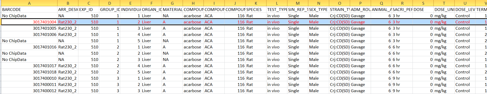

```{r setup, include=FALSE}
knitr::opts_chunk$set(echo = TRUE)
```

*Notice: You **don't** have to read this section for the contest*

In this part, I will walk you through details of our data and introduce some data preprocessing procedures.  I hope you could get a clear understanding of our data and are able to generate you own training dataset after this session.  

Basically, we will use rat in vivo liver differential gene expression data as training data and use the corresponding pathology terms as labels. All these data can be extracted from [TG-GATEs database](https://doi.org/10.1093/nar/gku955).  For your quickly understanding , imagine our training data as a matrix whose rows represent samples and columns represent features. In more details, each sample(row) represents differential gene expression levels in liver for a  rat at certain time point and certain drug dose level. And each feature(column) represents expression level of a certain gene across different samples. Each sample has a pathological record for each pathology from TG-GATEs.

---

 
## Gene expression data 

Before we go further, let's first introduce what is gene expression data. Gene is the basic physical and functional unit of heredity among all the species. Slight difference between genes decide individual's unique physical features. Gene controls the traits or phenotypes of species by transcription and translation to RNAs and proteins. The expression level of transcription and translation  can be detected by [microarrays](https://en.wikipedia.org/wiki/DNA_microarray) or next generation sequencing techniques(NGS), which is called gene expression data.

The gene expression levels in rat in vivo liver in [TG-GATEs][Link to TG-GATEs paper] are measured by microarrays. So the results are stored in .CEL file format and all the CEL data pass the quality control  [QC](https://www.ncbi.nlm.nih.gov/pubmed/15364885)

Then let's get a intuitive understanding of gene expression data from rat in vivo liver that administered acarbose in single-dose experiment(See below what is [single-dose experiment](#single_dose_experiment) in TG-GATEs). In the folder of "TG-GATEs/rat/in_vivo/Liver/Single/acarbose.Rat.in_vivo.Liver.Single",
there is a folder called "celfiles" containing CEL files for each specific drug administered experiment. Another Attribute.csv file in this folder includes metadata for each CEL file in "celfiles" directory. 

<center></center>

<br>
For example, the second row in Attribute.csv file have a attribute "BARCODE" with value "3017401004"

<center></center>

<br>
This means this row is meatadata for "003017401004.CEL" in "celfiles" folder. 

<center></center>

<br>
The attributes "ORGAN", "COMPOMD_NAME","SPECIES","TEST_TYPE","SIN_REP_TYPE","SACRI_PERIOD" and "DOSE_level " in second row of attributes file tell us "003017401004.CEL" containing the gene expression data of liver for rat administered acarbose, which was measured at 3 hour with dose level "control". Notice for each experimental condition,there are several samples(i.e. Several CELfiles) to [increase statistical power](https://www.illumina.com/Documents/products/technotes/technote_power_replicates.pdf).

To obtain gene expression data, we load all the CEL data in this folder and preprocess them with R packages ["affy"](https://www.bioconductor.org/packages/release/bioc/html/affy.html). This is necessary and reasons for this  are explained in [This paper](https://www.ncbi.nlm.nih.gov/pubmed/14960456 )

* Read all the CEL files from acarbose administered experiment by function "ReadAffy" to "AffyBatch" object

```{r}

library(affy)
cell_dir="../TGGATEs_tutorial_secrete/acarbose.Rat.in_vivo.Liver.Single"
fns=list.celfiles(path=paste(cell_dir,"celfiles",sep = "/"),full.names=TRUE)
data=ReadAffy(filenames = fns)

```


* Then we can use function "rma" in "affy" package to preprocess our data by following steps:
  1. Background correction 
  2. Normalization 
  3. Computation of expression data 
  
Function "rma"" will transfer our "AffyBatch" object into "ExpressionSet" object.  ["ExpressionSet" object](https://www.bioconductor.org/packages/3.7/bioc/vignettes/Biobase/inst/doc/ExpressionSetIntroduction.pdf) is a class frequently used  in genomics to manage high-throughput assays and experimental meatadata. 


```{r}
eset=rma(data,normalize = TRUE)
head(exprs(eset))

```

"exprs" function returns expression data of our experiment. Columns refer to samples and rows refer to [probeset](https://www.ensembl.org/info/genome/microarray_probe_set_mapping.html) in microarray.

* From "Attribute.tsv"" file, we can add "phenoData" to "ExpressionSet" to describe samples in the experiment

```{r}
pheno=read.table(paste(cell_dir,"/Attribute.tsv",sep = ""),sep = "\t",header = TRUE,fileEncoding="latin1")
pheno=pheno[which(pheno[,"BARCODE"]!="No ChipData"),]
rownames(pheno)=paste("00",sub('^0+',"",pheno[,"BARCODE"]),".CEL",sep = "") 
pheno=pheno[colnames(exprs(eset)),]
pData(eset) = pheno
head(pData(eset))
```


* Annotate probesets of microarray to gene names by [ribiosAnnotation](https://github.com/Accio/ribios/tree/master/ribiosAnnotation) to describe features in the experiment.
Since [each gene is usually represented by more than on probeset](https://www.biostars.org/p/54632/), we use [ribiosUtils](https://github.com/Accio/ribios/tree/master/ribiosUtils) to further preprocess data to get unique gene names for our data .

```{r}
library(ribiosAnnotation)
library(ribiosUtils)
geneName=annotateProbesets(featureNames(eset), orthologue = TRUE)
fData(eset) <- geneName
eset_rmNA=eset[!is.na(fData(eset)[,"GeneID"]),]
index_uniqueProbe=isMaxStatRow(exprs(eset_rmNA),keys = fData(eset_rmNA)[,"GeneSymbol"])
eset=eset_rmNA[index_uniqueProbe,]
```

* After we get expression data, we remove gene with expression level less than 6 as these data are  unreliable
```{r}
eset <- eset[apply(exprs(eset), 1, max, na.rm=TRUE)>6,]
```


## Diffrential gene expression data 

But here we use differential gene expression data other than gene expression data mainly because of [batch effect](https://www.ncbi.nlm.nih.gov/pmc/articles/PMC3880143/) as  TG-GATEs  is a long period(10 years) project conducted  by various  institutes and companies.

Differential gene expression data means quantitative changes of gene expression level between different experimental groups.  Here we calculate differential gene expression for each experimental condition  compared with control experimental condition.

The method we used to calculate differential gene expression data is called [limma](https://www.ncbi.nlm.nih.gov/pubmed/16646809),which is a R package that fit a linear model to the expression data for each gene. By elaborate design matrix and contrast matrix, we can get various statistics from limma to (e.g. log folder changes and moderated t-statistics) describe differential gene expression data.  

Below is the code we used to obtain differential gene expression data for one drug.

```{r}
library(limma)
# the function used to calculate diffrential gene expression data 
# regard experiment with dose level "control" and earliest time point as control group 

limmaTG<-function(eset_timei_contrast,filename){
   f=factor(eset_timei_contrast$DOSE_LEVEL)
   # get dose information
   uni_levels=unique(f)
   level=uni_levels[-(which(uni_levels=="Control"))]
   # get csww information,  csww contains compound type, species, in vitro/vivo and organism information 
   csww=tail(unlist(strsplit(filename,"/")),n=1)
   #get time information
   timepoint=unique(pData(eset_timei_contrast)$SACRI_PERIOD)
   # get sample name 
   sample_name=paste(csww,timepoint,level,sep = "/")
   design=model.matrix(~+f)
   fit=lmFit(eset_timei_contrast,design)
   fit=eBayes(fit)
   nenv=new.env()
   #add logFC data as differential gene  experssion data
   fit_topTable <- topTable(fit,coef = 2,number = nrow(fit$genes))
   fit_exprs=matrix(fit_topTable$logFC)
   #rownames(fit_exprs)=rownames(fit$genes)  ## errors here ,fuck 
   rownames(fit_exprs)=fit_topTable$GeneSymbol  ## when using some function, you'd better understand its 
                                             ## function exactly 
   colnames(fit_exprs)=sample_name
   #plot(fit_exprs,fit_topTable$logFC)
   assign("exprs",fit_exprs,nenv)
  
   fit_eset=ExpressionSet(assayData = nenv)
   fit_pheno=data.frame(time=timepoint,dose=level,csww=csww) 
   rownames(fit_pheno)=colnames(fit_exprs)
   pData(fit_eset)=fit_pheno
   
   fData(fit_eset)=fit$genes
   return(fit_eset)
   
}

# obtain all the experimental time points 
time_points=unique(pData(eset)$SACRI_PERIOD)
esets=list()
# loop used to calculate diffrential gene expression data for all the experimental groups compared with corrsponding control gruops
for (i in 1:length(time_points)) {
   eset_timei=eset[,which(pData(eset)$SACRI_PERIOD==time_points[i])]
   dose_levels=unique(pData(eset_timei)$DOSE_LEVEL)
   dose_levels=dose_levels[-which(dose_levels=="Control")]
   eset_timei_contrasts=list()
   for (ii in 1:length(dose_levels)) {
     eset_timei_contrasts[[ii]]=eset_timei[,c(which(eset_timei$DOSE_LEVEL=="Control"),which(eset_timei$DOSE_LEVEL==dose_levels[ii]))]
   }
   esets[[i]]=lapply(eset_timei_contrasts, limmaTG,filename=cell_dir)
}

 #combine all diffrential gene expression data of this certain compound into one
 compound_esets=list()
 index=1
 for (i in 1:length(esets)) {
   for (j in 1:length(esets[[i]])) {
     compound_esets[[index]]=esets[[i]][[j]]
     index=index+1
   }
 }
 fenv=new.env()

 compound_common_features=rownames(compound_esets[[1]])
 for (i  in 2:length(compound_esets) ) {
   compound_common_features=intersect(compound_common_features,rownames(compound_esets[[i]]))
 }
 
 for (i in 1:length(compound_esets)) {
   compound_esets[[i]]=compound_esets[[i]][compound_common_features,]
 }
 
 compound_exprs=sapply(compound_esets,exprs)
 rownames(compound_exprs)=rownames(compound_esets[[1]])
 colnames(compound_exprs)=sapply(compound_esets, function(x){colnames(exprs(x))})
 assign("exprs",compound_exprs,fenv)
 
 
 compound_final_eset=ExpressionSet(assayData = fenv)
 compound_pheno=lapply(compound_esets, pData)
 compound_pheno=do.call("rbind",compound_pheno)
 pData(compound_final_eset)=compound_pheno
 
 fData(compound_final_eset)=fData(compound_esets[[1]])
 saveRDS(compound_final_eset,file = paste(cell_dir,".rds",sep = ""))
```

From above, we get a "ExpressionSet" object storing differential gene expression data from a specific drug experiment.
We write it into a ".rds" R data for further data combination 

```{r}
drug_exprs=exprs(compound_final_eset)
head(drug_exprs)
```


## Experimental design  in  TG-GATEs

There are two types of studies to measure gene expression data from rat in vivo liver : single-dose study and repeat-dose study.  [" For single-dose experiments, groups of 20 animals were administered a compound and then five animals/time point were sacrificed at 3, 6, 9 or 24 h after administration. For repeated-dose experiments, groups of 20 animals received a single dose per day of a compound and five animals/time point were sacrificed at 4, 8, 15 or 29 days (i.e. 24 h after the respective final administration at 3, 7, 14 or 28 days )" ]([Link to TG-GATEs paper])


## Data combination

<a name="single_dose_experiment"></a>In data combination step, we combine differential gene expression data(i.e. ".rds" data we stored in data preprocessing step) from different compounds in two types of studies. Besides, from pathology information in TG-GATEs,  we extract pathology terms for corresponding samples. Please see the [Easy Start section ](easy_start.html) for final data format. 


[Link to TG-GATEs paper]: https://www.ncbi.nlm.nih.gov/pubmed/25313160

---


